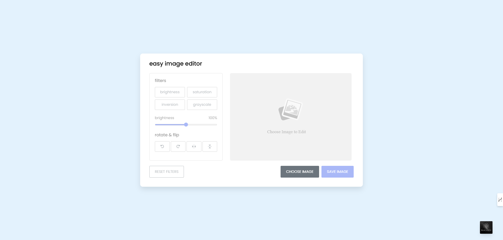
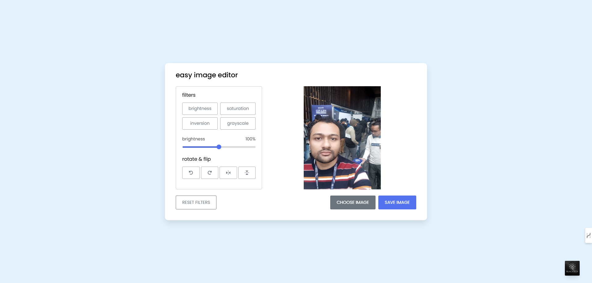
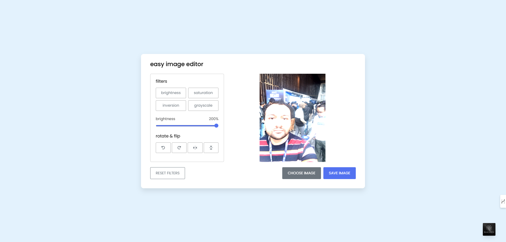
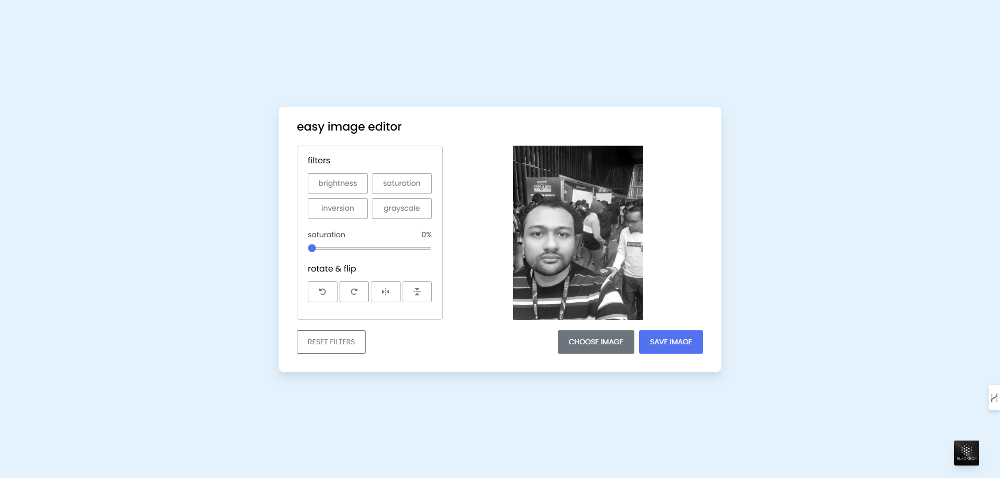
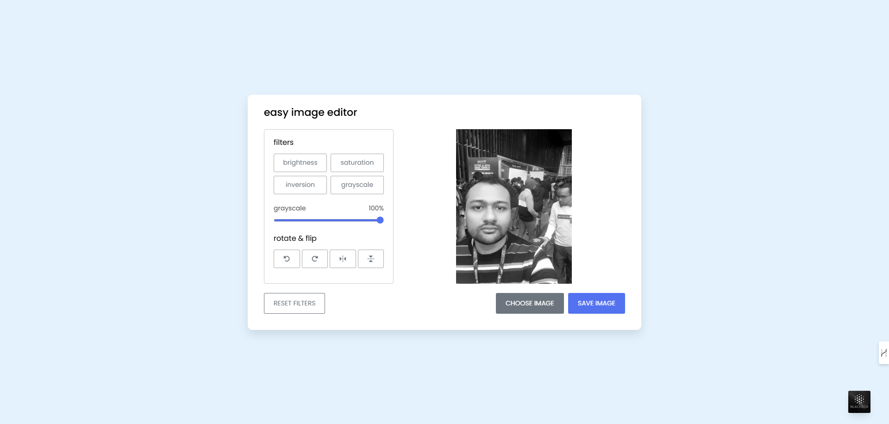
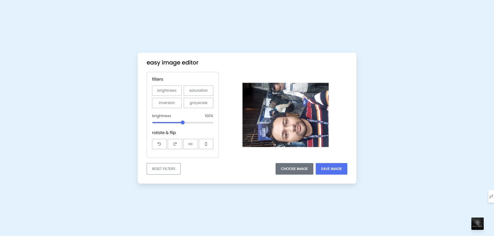
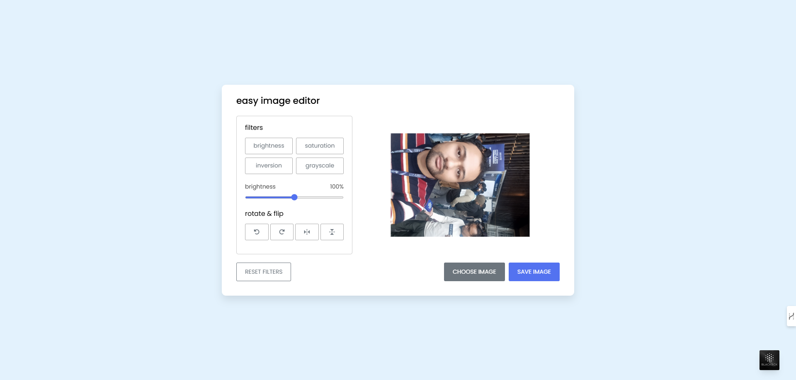
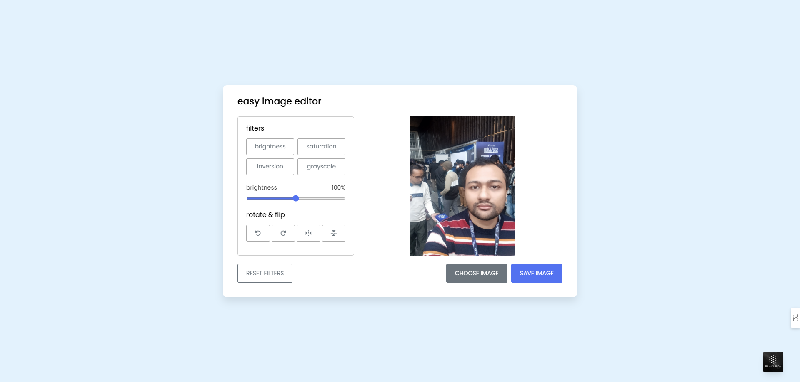
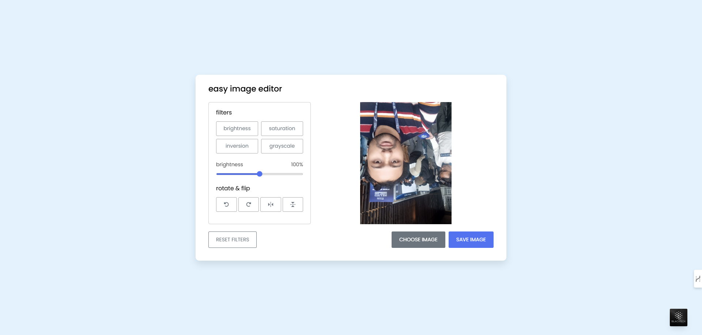

# Image-Editor-Application
A lightweight, elegant image editor application offers essential image editing capabilities without any external dependencies.
## Overview
A nice yet simple image web-based application that lets you perform basic image editing right in your browser. Designed with a clean and responsive interface, it’s perfect for quick adjustments and creative experiments without the overhead of external libraries or frameworks.
## Technology Used
- HTML
- CSS
- JavaScript
## Features
1. Choose Image to Upload & Display on Screen to Support (.jpg, .png, .wepb, .gif).
2. Filter Presets (Brightness, Saturation, Inversion, Grayscale).
3. Real-time Adjustment Range Slider to Control Filters.
4. Rotate Left/Right to Change the Image Position.
5. Flip Horizontal/Verticel to Manipulate the Innter Position.
6. Reset the Image to Filter.
7. Save Image the Customized Picture to Download on Your Desktop
## Usage or Installation
To run the project locally, follow these steps:
1. **Clone the repository:**
```bash
   git clone https://github.com/yourusername/your-repo-name.git
```
3. **Navigate to the project directory:**
```bash
   cd your-repo-name
```
5. **Open the app:** Open ```index.html``` in your Prefered Web Browser.
##Screenshots










## Contributing
Contributions are welcome! Feel free to submit pull requests or create issues for bugs and feature requests.
1. Fork the repository.
2. **Create your feature branch:**
   ```bash
      git checkout -b feature/amazing-feature
   ```
3. **Commit your changes:**
   ```bash
      git commit -m 'Add some amazing feature'
   ```
4. **Push to the branch:**
   ```bash
      git push origin feature/amazing-feature
   ```
5. Open a pull request.
